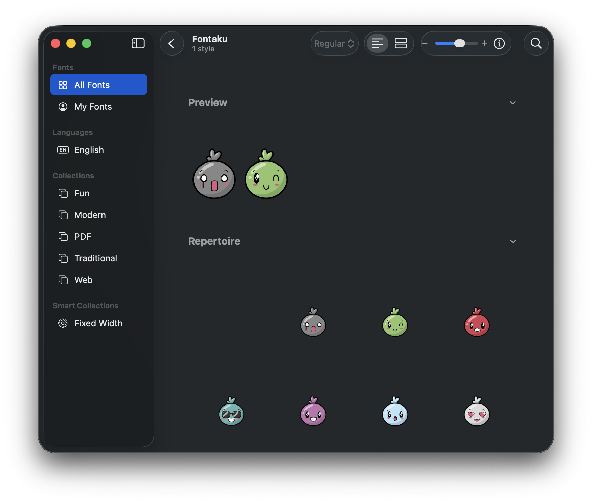

# Fontaku Font Generator

This project generates custom emoji fonts from PNG images for macOS. It creates OpenType fonts with SBIX (bitmap emoji) tables that could be used as system emojis and appear in the emoji picker, just like Apple's native emojis.



## Overview

The project converts a collection of PNG emoji images into a fully functional TrueType font file that can be installed and used on macOS. The generated font maps PNG images to standard emoji Unicode codepoints (starting at U+1F600 😀), allowing your custom emojis to:

- ✅ **Appear in the macOS emoji picker**
- ✅ **Replace system emojis** (😀, 😁, 😂, etc.)
- ✅ **Work in all applications** (text editors, messaging apps, browsers)
- ✅ **Scale properly** at all text sizes

## Usage

### Requirements
- Python 3.7+
- FontTools and Pillow libraries (see `requirements.txt`)

### Installation
```bash
pip install -r requirements.txt
```

### Generate the Font
Place your PNG images in the `images/` directory with filenames like:
- `U+E001.png`
- `U+E002.png`
- `U+E003.png`
- etc.

Then run:
```bash
python generate.py
```

This will generate `Fontaku.ttf` which you can install by double-clicking it and selecting "Install Font" in Font Book.

## Automated Releases

This project includes a GitHub Actions workflow that automatically builds and releases the font when you push a version tag.

### Creating a Release

1. Commit and push your changes (including any new images)
2. Create and push a version tag:
   ```bash
   git tag v1.0.0
   git push origin v1.0.0
   ```
3. The workflow will automatically:
   - Build the font using your latest images
   - Create a GitHub release with the tag name
   - Attach the `Fontaku.ttf` file to the release
   - Generate release notes

### Downloading Pre-built Fonts

Visit the [Releases](../../releases) page to download pre-built font files without needing to run the generator yourself.

## How It Works

The font generation process uses Apple's SBIX (Standard Bitmap Image eXtension) format:

1. **Image Processing**: PNG images are resized to multiple sizes (32, 64, 128, 256 ppem) while maintaining aspect ratio and centered in square canvases
2. **Font Metrics**: Uses metrics matching Apple Color Emoji (800 units per em, advance width of 800)
3. **Unicode Mapping**: Maps to standard emoji codepoints starting at U+1F600 (😀)
4. **SBIX Tables**: Embeds bitmap data at multiple strikes for proper scaling
5. **Glyph Centering**: Images are horizontally and vertically centered using proper origin offsets and canvas positioning

The resulting font can be installed system-wide and will override Apple's default emojis, displaying your custom PNG artwork instead. Your emojis will appear in the emoji picker alongside (or replacing) system emojis.

## Important Notes

### Emoji Picker Preview Limitation

⚠️ **The macOS emoji picker will NOT show previews of your custom Fontaku font.** The emoji picker interface is hardcoded to use Apple Color Emoji for its preview grid.

However:
- ✅ When you **select and insert** an emoji from the picker, it **will render** using your Fontaku font in the actual text
- ✅ Your custom emojis will display correctly in all applications (text editors, browsers, messaging apps)
- ✅ Only the emoji picker's preview grid itself shows Apple's defaults

This is a macOS system limitation that cannot be overcome without modifying system files. Your custom emojis work perfectly once inserted into text!

## Image Attribution

Images by https://www.freepik.com/author/gstudioimagen
